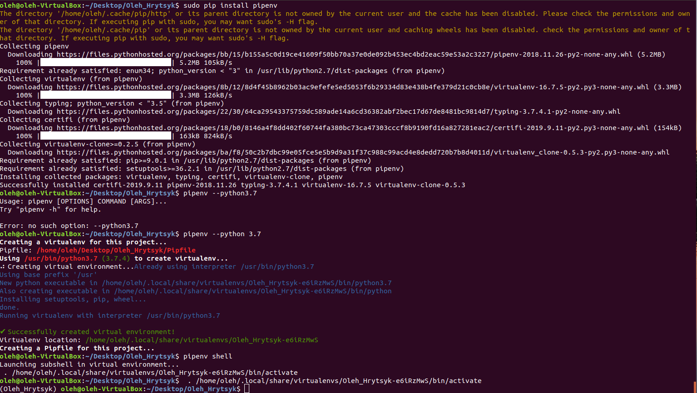
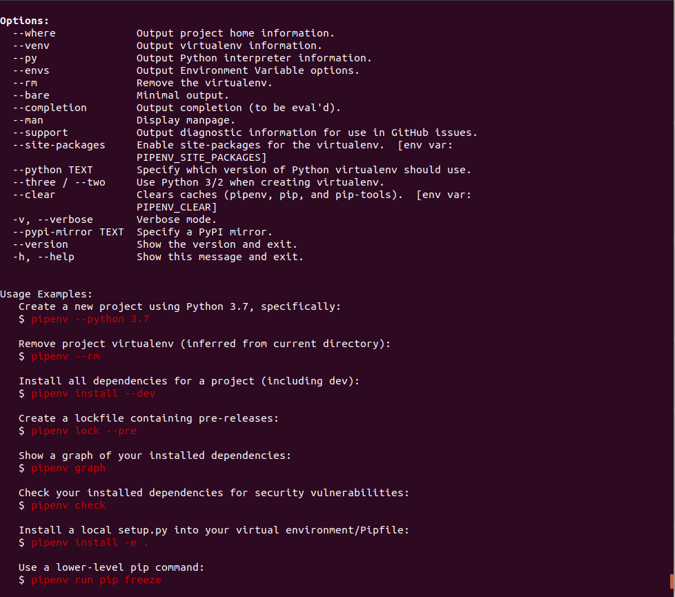
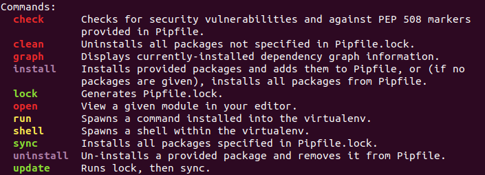

#Лабораторна 2
##### 1. Створив папку lab2 з файлом README.md
##### 2. Інсталював pipenv за допомогою пакетного менеджера PIP, створив ізольоване середовище для Python та ознайомився з командою pipenv -h.

