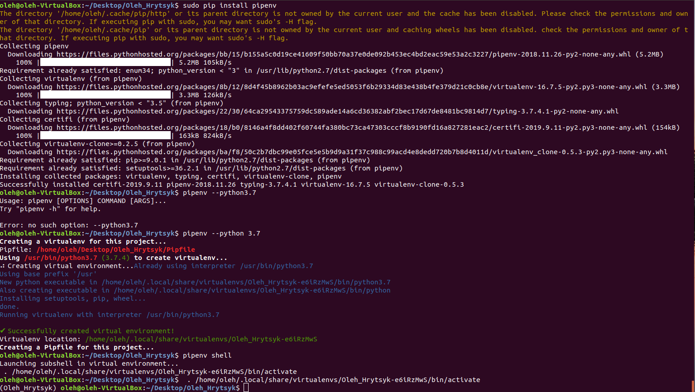
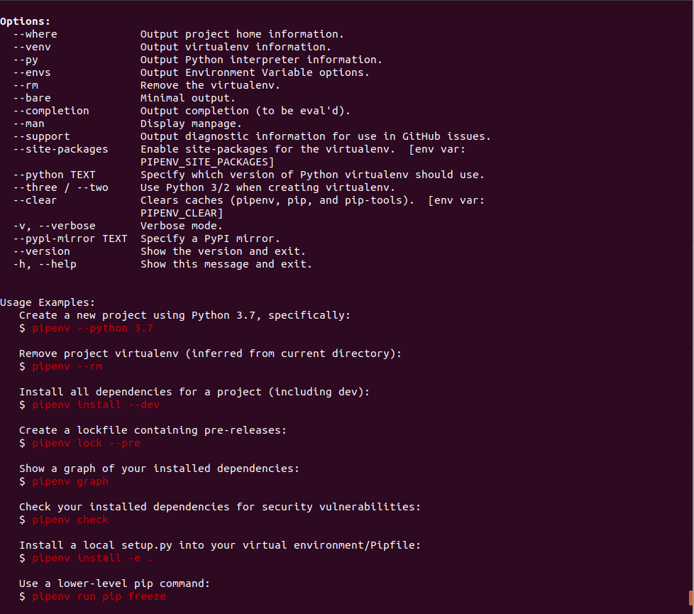
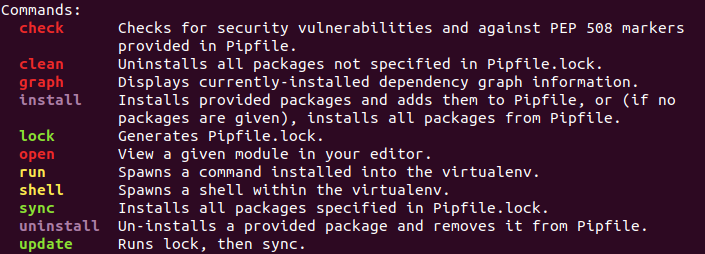
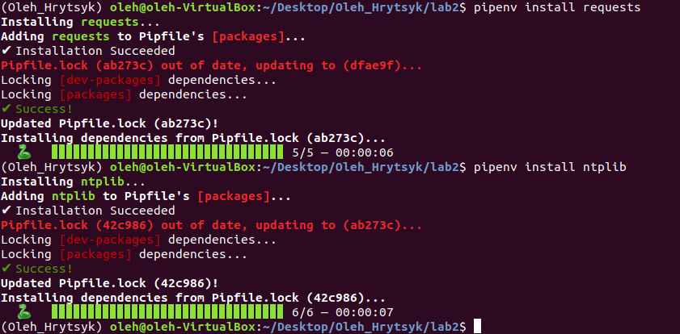
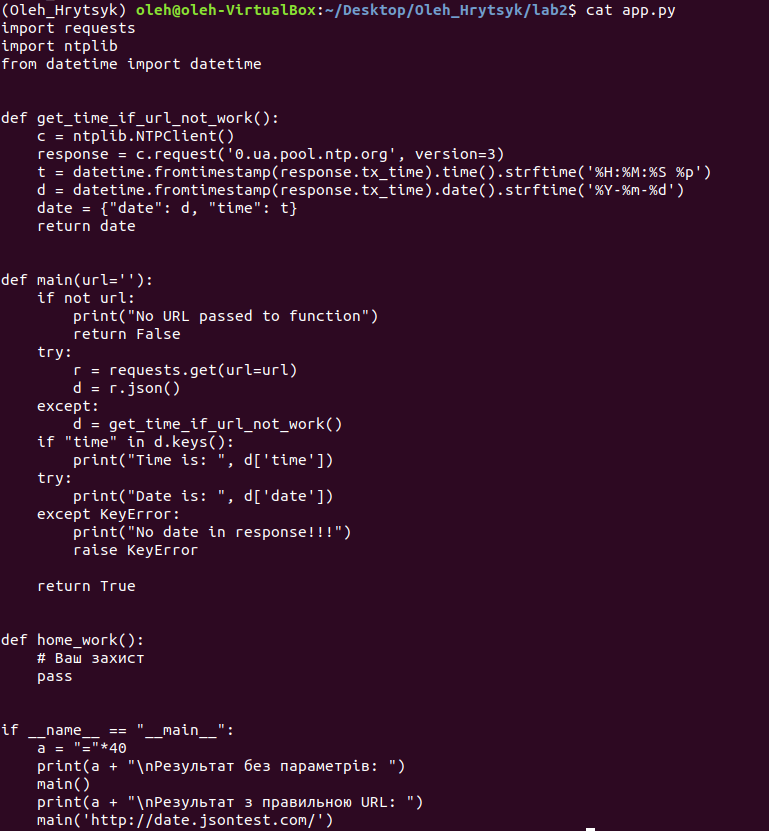
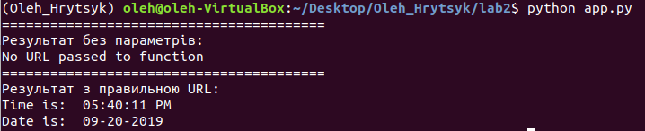

#Лабораторна 2
##### 1. Створив папку lab2 з файлом README.md
##### 2. Інсталював pipenv за допомогою пакетного менеджера PIP, створив ізольоване середовище для Python та ознайомився з командою pipenv -h.

##### 3. Встановив бібліотеки requests та ntplib.

##### 4. Створив файл app.py та скопіював туди код з репозиторія.

##### 5. Перевірив чи програма працює наступною командою

##### 6. Встановив бібліотеку pytest

