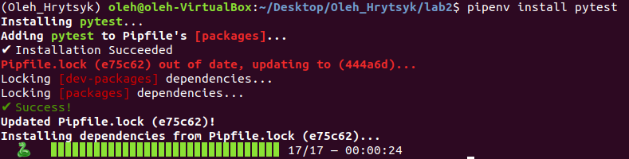

#Лабораторна 2
##### 1. Створив папку lab2 з файлом README.md
##### 2. Інсталював pipenv за допомогою пакетного менеджера PIP, створив ізольоване середовище для Python та ознайомився з командою pipenv -h.

##### 3. Встановив бібліотеки requests та ntplib.

##### 4. Створив файл app.py та скопіював туди код з репозиторія.

##### 5. Перевірив чи програма працює наступною командою

##### 6. Встановив бібліотеку pytest

##### 7. Виконав тести, вони виконались успішно

##### 8. Написав функцію яка перевіряє AM i PM в даті, у випадку AM виводить Good day! , А при PM - Good night!

##### 9. Написав тест який пройшов успішно

##### 10-11. За допомогою команди pytest tests/tests.py > results.txt створився текстовий файл в який записано результат тесту. За допомогою команди python app.py >> results.txt я дописав результат виконання програми в файл.
##### 12-13. Заповнив Makefile необхідними командами

