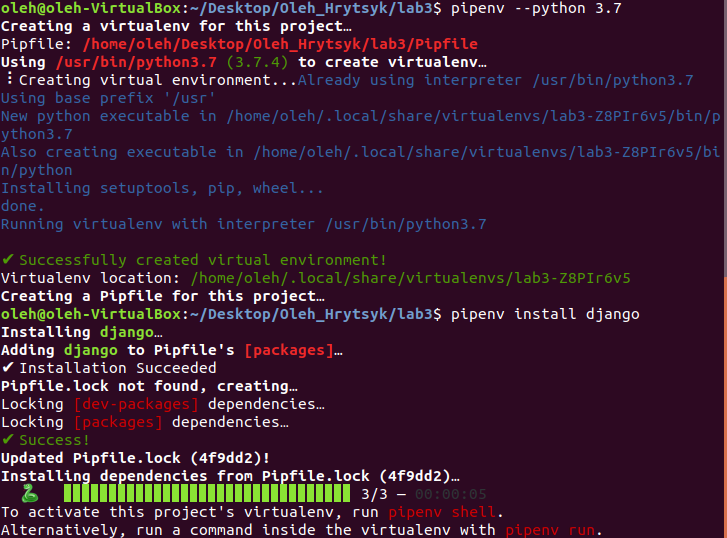
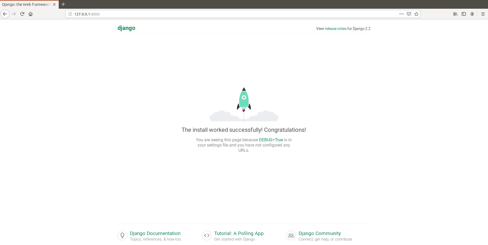

# Лабораторна 3
##### 1. Створив папку lab3 та ініціалізував середовище pipenv.

##### 2.  Створив заготовку мого проекту за допомогою Djambo Framework
##### 3-4. Виконав вказану команду та перейшов за посиланням 127.0.0.1:8000

