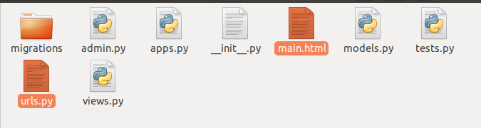
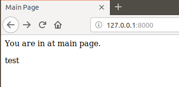

# Лабораторна 3
##### 1. Створив папку lab3 та ініціалізував середовище pipenv.

##### 2.  Створив заготовку мого проекту за допомогою Djambo Framework
##### 3-4. Виконав вказану команду та перейшов за посиланням 127.0.0.1:8000

##### 5-6. Створив темплейт main, файл html в папці main та urls.py

##### 7-10. Заповнив та відредагував файли main.html, urls.py, views.py. Після цього запустив сервер. Результат:

.png)
##### 11. Встановив біблиотеку requests командою pipenv install requests

