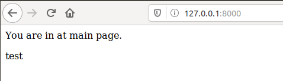

# Лабораторна 4

##### 1-2. Перевірив роботу докера та перенаправив вивід тексту з консолі в my_work.log.
##### 3-4. Створив Імедж, створив Dockerfile та скопіював туда текст змінивши поилання.
##### 5-6. Створів власний репозиторій на докер [ось тут](https://hub.docker.com/r/hrytsyk/lab4_repos/tags) та виконав білд імеджа django.

##### 7. Переконався що сайт працює.

##### 8. Створив Dockerfile.monitoring, створив новий тег, витягнув server.log
