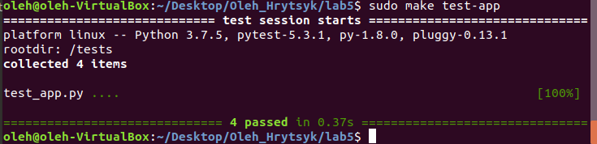
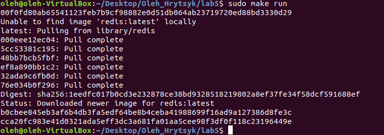
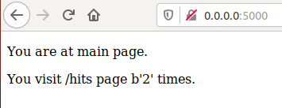
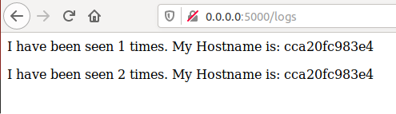
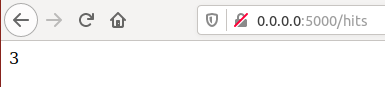
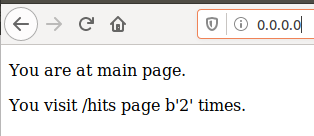
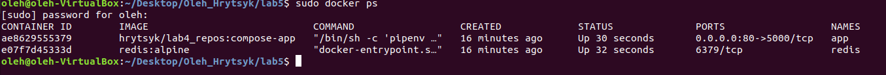

# Лабораторна робота №5

##### 1-5. Прочитав про docker-compose, бібліотеку Flask, створив папку my_app та tests і скопіював туди файли.
##### 6. Ініціював середовище для програми та тестів командами 
###### pipenv --python 3.7
###### pipenv install -r requirements.txt
##### та переконався що все працює
##### 7-8. Створив два Dockerfile та Makefile, в якому директиви виконують наступні дії
##### - STATES := app tests змінні яким динамічно присвоюються значення
##### - REPO := tarasshynkler/firstrepos:lab5 репозиторій на Docker Hub
##### - .PHONY: $(STATES) несправжні цілі
##### - run виконує команди
##### - docker-prune очищує ресурси
##### 9. запустив команди sudo make app та sudo make tests, після чого запустив команду sudo make run і відкрив нове вікно терміналу де запустив команду sudo make test-app
##### результати виконання команд

##### сторінки браузера

##### 10-12. зупинив проект, почистив все командою sudo make docker-prune та додав директиви в  makefile
##### 13. Створив docker-compose.yml та заповнив його згідно зразку в основному репозиторію.
##### 14-15. Docker-compose встановлений та працює, далі запустив docker-compose командою docker-compose -p lab5 up. Веб сайт працює але потрібно перейти на адресу 0.0.0.0:80

##### 16. Імеджі:

##### 17-19. Зупинив процес, завантажив створені імеджі на docker hub командою docker-compose push. Для дій з системою краще використовувати Makefile, для дій пов'язаних з Docker краще docker-compose.yml
##### 20. Docker-compose.yml в лаб4.
